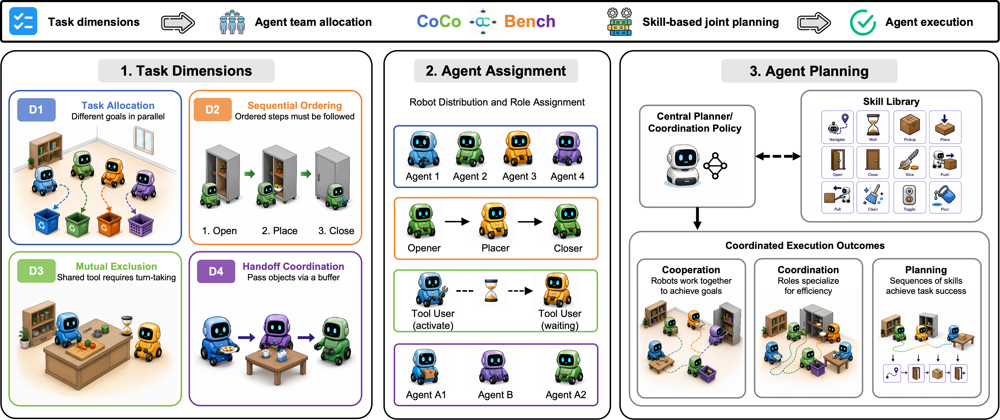

# 🤖 CoCoBench

**Multi-agent embodied coordination benchmark for AI2-THOR / iTHOR.**

<p align="center">
  
</p>

CoCoBench evaluates whether a VLM can *coordinate* several agents rather than just solve a task. Each instance isolates one coordination mechanism so failures can be attributed precisely:

| Dim | Mechanism | Failure signal |
|-----|-----------|----------------|
| `D1` | Independent parallelism / task allocation | One agent does everything; the other idles |
| `D2` | Sequential dependency / temporal planning | Acting before a precondition holds |
| `D3` | Resource exclusion / conflict resolution | Two agents contend for one tool or pose |
| `D4` | Relay handoff / producer–consumer | Consumer acts on an empty transfer buffer |

**897 instances** · 6 task families · 2–4 agents · kitchen / living-room / bedroom scenes · no judge model — success is evaluated from simulator goal state.

---

## 📦 Installation

> Linux · Python ≥ 3.9 · Vulkan-capable GPU (for headless rendering)

```bash
git clone <repository-url>
cd CoCoBench-anonymous

python -m venv .venv
source .venv/bin/activate
pip install -r requirements.txt
```

AI2-THOR downloads its Unity build on first run (~1–2 GB, cached under `~/.ai2thor`).

---

## 🗂 Dataset

No download needed — all 897 instances are versioned under `benchmark/task_config/`.

| Family | Instances | Scenes | Theme |
|--------|-----------|--------|-------|
| `A` | 41 | Kitchen | Grocery storage, ordered cabinet loading |
| `C` | 204 | Living room / bedroom | Ordered container loading, relay |
| `G` | 104 | Living room / bedroom | Parallel personal-item sorting |
| `H` | 206 | Bedroom / living room | Drawer storage and ordered loading |
| `J` | 112 | Bedroom / living room | Cross-zone handoff relay |
| `K` | 230 | Kitchen | Shared-knife slicing under exclusion |

The `rep240` curated subset (240 instances, stratified by dim × agents × cell) is recommended for full-coverage runs at reasonable cost.

---

## 🚀 Running an evaluation

### 1. Set credentials

```bash
# OpenAI-compatible
export OPENAI_API_KEY="..."
export OPENAI_BASE_URL="https://api.openai.com/v1"

# Anthropic-compatible
export ANTHROPIC_AUTH_TOKEN="..."
export ANTHROPIC_BASE_URL="https://api.anthropic.com"
export ANTHROPIC_MODEL="<model-id>"
```

### 2. Batch evaluation

```bash
cd benchmark

python eval/evaluate_vlm.py \
  --vlm-backend openai \
  --vlm-model <model-id> \
  --eval-set rep240 \
  --jobs 8 \
  --resume \
  --exp-name my-run
```

### 3. Condition sweep (centralized / distributed × image / blind)

```bash
bash run_eval.sh --model <model-id> --conditions all --eval-set rep240 --jobs 8
```

Condition shortcuts: `all`, `image`, `blind`, or individual names like `C0_image`, `D1_blind`.

### 4. Single task

```bash
# Oracle reference policy
python eval/runner.py --task-config task_config/A/D1/A_D1__FloorPlan1__seed0.json --oracle-plan auto

# Model-driven
python eval/runner.py --task-config <path> --vlm --vlm-backend openai --vlm-model <model-id>
```

---

## 📊 Metrics

Results land in `benchmark/outputs/eval_runs/<exp-name>/`. Recompute from a trajectory at any time:

```bash
python eval/metrics.py outputs/eval_runs/<exp>/<set>/*/trajectory.json
```

Key metrics: `success`, `subgoal_success_rate`, `legal_plan`, `construct_score` (per-dimension coordination score ∈ [0, 1]), `makespan`, `load_imbalance`, `dependency_violations`, `occupancy_conflicts`.

---

## 🧩 Adding a model backend

Implement `choose(prompt, image_path, menu) -> str` and register it in `eval/vlm_policy.py`:

```python
class MyVLM:
    name = "myvlm"
    def choose(self, prompt, image_path, menu):
        return "ACTION: 7"   # or "DONE"
```

Built-in baselines: `random` (no-strategy floor), `greedy` (skill-priority heuristic), `mock` (deterministic, no network).

---

## 📁 Repository layout

```
benchmark/
  eval/            Runner, batch evaluator, metrics, VLM backends, oracles
  task_config/     897 instances + eval-set index + rep240 subset
  tools/           Instance generators, index builder, validator
  *.py             Environment, actions, navigation, skill execution
  run_eval.sh      Condition-sweep driver
  configs/         Evaluation config template
requirements.txt
```
